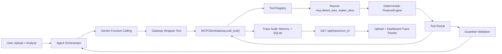

# MCP Gateway Architecture (P0)

## Runtime Flow

## Design Guarantees
- Agent/business code does not call finance tools directly.
- Centralized tool invocation API:
  - `MCPClientGateway.call_tool(...)`
- Tool call metadata is always traced:
  - `status`, `latency_ms`, `arguments`, `result`, `error_message`
- Guardrail remains deterministic:
  - Only SKUs validated by `FinanceEngine.get_loss_makers()` are accepted.

## P0 Notes
- P0 uses in-process registry routing instead of stdio transport.
- Gateway interface is production-oriented and transport-agnostic.
- Stdio/SSE transport can be introduced later without changing agent API.
