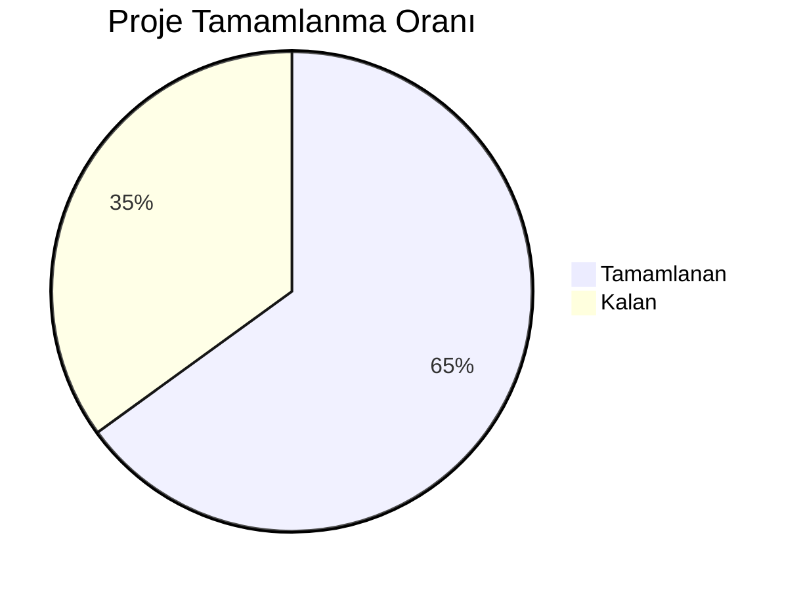
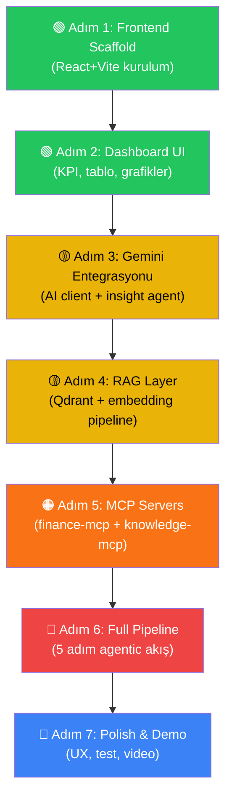

# 🛡️ KârGuard AI — Proje Durum Raporu & TODO Listesi

> **Son Güncelleme:** 13 Mayıs 2026  
> **Mimari Referans:** Final Mimari Diyagramı (Gemini + RAG + MCP + Deterministic Finance Engine)

---

## 📊 Genel İlerleme Özeti

| Katman | Durum | Tamamlanma |
|--------|-------|------------|
| ① Kullanıcı Arayüzü (Frontend) | ✅ Çalışıyor | %100 |
| ② FastAPI Backend | ✅ Çalışıyor | %90 |
| ③ AI Katmanı (Gemini) | ✅ Büyük oranda tamam | %80 |
| ④ Deterministic Finance Engine | ✅ Çalışıyor | %100 |
| ⑤ MCP Tool Katmanı | ❌ Başlanmadı | %0 |
| ⑥ RAG / Knowledge Layer (Qdrant) | ❌ Başlanmadı | %0 |
| ⑦ Veri Katmanı | ✅ Mock veriler hazır | %80 |

---

## ✅ YAPILANLAR (Tamamlanan İşler)

### 1. Proje Altyapısı
- [x] Proje dizin yapısı oluşturuldu (`backend/app/`)
- [x] `.gitignore` yapılandırıldı
- [x] `.env.example` hazırlandı (Gemini API key, Qdrant, Debug)
- [x] `requirements.txt` — tüm bağımlılıklar belirlendi:
  - FastAPI, Uvicorn, Pandas, Pydantic, google-genai, qdrant-client, mcp
- [x] Python `venv` oluşturuldu

### 2. FastAPI Backend (Orkestrasyon Katmanı)
- [x] [main.py](file:///c:/Users/PC/Desktop/karguard-ai/backend/app/main.py) — FastAPI app, CORS, 6 router kayıtlı
- [x] [config.py](file:///c:/Users/PC/Desktop/karguard-ai/backend/app/config.py) — Pydantic Settings (Gemini, Qdrant, Paths)
- [x] **6 API Endpoint aktif:**

| Endpoint | Dosya | Durum |
|----------|-------|-------|
| `POST /api/upload` | [upload.py](file:///c:/Users/PC/Desktop/karguard-ai/backend/app/api/upload.py) | ✅ Çalışıyor |
| `POST /api/analyze/{run_id}` | [analyze.py](file:///c:/Users/PC/Desktop/karguard-ai/backend/app/api/analyze.py) | ✅ Çalışıyor |
| `GET /api/dashboard/{run_id}` | [dashboard.py](file:///c:/Users/PC/Desktop/karguard-ai/backend/app/api/dashboard.py) | ✅ Çalışıyor |
| `GET /api/products/{run_id}` | [products.py](file:///c:/Users/PC/Desktop/karguard-ai/backend/app/api/products.py) | ✅ Çalışıyor |
| `POST /api/simulate/{run_id}/{sku}` | [simulate.py](file:///c:/Users/PC/Desktop/karguard-ai/backend/app/api/simulate.py) | ✅ Çalışıyor |
| `POST/GET /api/actions/...` | [actions.py](file:///c:/Users/PC/Desktop/karguard-ai/backend/app/api/actions.py) | ✅ Çalışıyor |

### 3. Deterministic Finance Engine (Katman 4)
- [x] [finance_engine.py](file:///c:/Users/PC/Desktop/karguard-ai/backend/app/services/finance_engine.py) — 292 satır, tam fonksiyonel:
  - [x] SKU Profitability Engine — gelir, COGS, komisyon, kargo, iade, reklam hesaplama
  - [x] Risk Score Engine — ağırlıklı skor (kâr: %40, iade: %30, reklam: %20)
  - [x] Cashflow Forecaster (14 gün) — basit tahmin
  - [x] Dashboard KPI hesaplamaları
  - [x] In-memory cache mekanizması

### 4. Scenario Simulator
- [x] [simulation_service.py](file:///c:/Users/PC/Desktop/karguard-ai/backend/app/services/simulation_service.py) — What-if analizi:
  - [x] Fiyat değişikliği simülasyonu
  - [x] Reklam bütçesi değişikliği
  - [x] İade oranı değişikliği
  - [x] Talep değişimi simülasyonu

### 5. Agent Orchestrator (5 Adımlı Pipeline)
- [x] [agent_orchestrator.py](file:///c:/Users/PC/Desktop/karguard-ai/backend/app/services/agent_orchestrator.py) — Pipeline iskelet yapısı:
  - [x] Step 1: Data Quality Agent (dosya doğrulama)
  - [x] Step 2: Profitability Agent (finans hesaplama)
  - [x] Step 3: Loss Maker Agent (zarar eden ürün tespiti)
  - [x] Step 4: Insight Agent — Gemini ile Kök Neden Analizi
  - [x] Step 5: Action Agent — Gemini ile Aksiyon Planlama

### 6. Pydantic Data Models
- [x] [schemas.py](file:///c:/Users/PC/Desktop/karguard-ai/backend/app/models/schemas.py) — 165 satır, 15+ model:
  - [x] `SKUProfitability`, `DashboardKPIs`, `DashboardResponse`
  - [x] `RootCauseAnalysis`, `EvidenceItem` (şema hazır, implementasyon yok)
  - [x] `ProductIntelligence` (şema hazır, implementasyon yok)
  - [x] `SimulationRequest`, `SimulationResult`
  - [x] `ActionCard`, `ActionApprovalRequest`
  - [x] Enum'lar: `AnalysisStatus`, `ActionStatus`, `RiskLevel`

### 7. Mock Veri Seti (Katman 7)
- [x] 5 CSV dosyası hazır (`data/mock/`):
  - [x] `products.csv` — 5 ürün (Tişört, Jean, Sneaker, Çanta, Saat)
  - [x] `orders.csv` — 78 sipariş kaydı (Nisan 2026)
  - [x] `returns.csv` — 20 iade kaydı (Tişört ağırlıklı iade problemi)
  - [x] `ads.csv` — 12 reklam kaydı
  - [x] `reviews.csv` — 35 yorum (beden/renk şikayetleri dahil)
- [x] Test upload dizini (`uploads/mock001/`) — kopyalanmış

---

## ❌ YAPILACAKLAR (Kalan İşler)

### 🔴 Kritik Öncelik — Core Features

#### A. Frontend (React + Vite + Tailwind) — Katman 1
> Diyagramdaki: Upload & Analysis Start, Profit Control Tower, Product Intelligence & Actions

- [x] **Proje scaffold** — `npx create-vite` ile React + TypeScript kurulumu
- [x] **Tasarım sistemi** — renk paleti, tipografi, komponent kütüphanesi
- [x] **Sayfalar:**
  - [x] Landing / Upload sayfası (CSV sürükle-bırak)
  - [x] Analysis Progress — agent adımlarını canlı takip
  - [x] **Profit Control Tower (Dashboard):**
    - [x] KPI kartları (gelir, kâr, marj, iade oranı, 14g cashflow)
    - [x] Ürün tablosu (risk skoru sıralı, renk kodlu)
    - [x] Grafikler (kârlılık bar chart, risk heatmap)
  - [x] **Product Intelligence sayfası:**
    - [x] SKU detay kartı
    - [x] Kök neden analizi görseli
    - [x] RAG kanıtları (review/return/policy)
    - [x] Simülasyon arayüzü (slider'lı what-if)
  - [x] **Action Cards sayfası:**
    - [x] Aksiyon kartları listesi
    - [x] Onayla / Reddet / Düzenle (Human-in-the-Loop)
- [x] **API entegrasyonu** — axios/fetch ile tüm backend endpoint'lere bağlantı
- [x] **Responsive tasarım** — mobil uyum

#### B. AI Katmanı (Gemini API) — Katman 3
> Diyagramdaki: Structured JSON Output, Function Calling, Reasoning & Action Planning

- [x] **Gemini client service** oluşturma (`google-genai` SDK ile)
- [x] **Structured JSON output** — Gemini'dan `RootCauseAnalysis` şemasında yanıt alma
- [ ] **Function Calling** — Gemini'nin MCP tool'larını çağırabilmesi (MCP Katmanına bağlı)
- [x] **Insight Agent implementasyonu:**
  - [x] Zarar eden ürün verisini + RAG kanıtlarını Gemini'ye gönderme
  - [x] Kök neden analizi üretme (`main_cause`, `explanation`, `evidence`)
  - [x] Review'lardan problem tespiti (`review_problems`)
  - [x] İade nedenlerini gruplama (`return_reasons`)
  - [x] Ürün açıklaması eksiklikleri (`description_gaps`)
- [x] **Action Planning Agent** — LLM destekli akıllı aksiyon önerileri
  - [x] Kural tabanlı yerine Gemini ile bağlamsal aksiyon üretme
  - [x] Simülasyon sonuçlarını aksiyona dönüştürme

#### C. RAG / Knowledge Layer (Qdrant) — Katman 6
> Diyagramdaki: reviews_index, product_description_index, policy_index

- [ ] **Qdrant bağlantısı** — client setup ve health check
- [ ] **Embedding pipeline:**
  - [ ] `text-embedding-004` ile metin vektörleme
  - [ ] Review'ları vektörleştirme ve `reviews_index` collection'a yazma
  - [ ] Ürün açıklamalarını vektörleştirme → `product_description_index`
  - [ ] Pazar yeri politikalarını vektörleştirme → `policy_index`
- [ ] **Semantic Search fonksiyonları:**
  - [ ] `search_reviews_by_sku()` — SKU'ya göre ilgili yorumları getir
  - [ ] `search_product_description()` — ürün açıklama benzerliği
  - [ ] `retrieve_root_cause_evidence()` — kök neden kanıtı toplama
  - [ ] `search_marketplace_policy()` — politika eşleştirme
  - [ ] `generate_evidence_summary()` — kanıt özeti

#### D. MCP Tool Katmanı — Katman 5
> Diyagramdaki: A) finance-mcp + B) knowledge-mcp

- [ ] **A) Finance MCP Server** araçları:
  - [ ] `calculate_sku_profitability()` — tool olarak expose et
  - [ ] `detect_loss_makers()` — tool olarak expose et
  - [ ] `simulate_scenario()` — tool olarak expose et
  - [ ] `forecast_cashflow_14d()` — tool olarak expose et
  - [ ] `calculate_risk_score()` — tool olarak expose et
- [ ] **B) Knowledge MCP Server** araçları:
  - [ ] `search_reviews_by_sku()` — RAG search tool
  - [ ] `search_product_description()` — RAG search tool
  - [ ] `retrieve_root_cause_evidence()` — RAG search tool
  - [ ] `search_marketplace_policy()` — RAG search tool
  - [ ] `generate_evidence_summary()` — RAG summary tool
- [ ] **MCP ↔ Gemini bağlantısı** — Function Calling entegrasyonu

---

### 🟡 Orta Öncelik — Veri & Altyapı

#### E. Destek Dosyaları (Veri Katmanı Eksikleri)
> Diyagramda var ama projede YOK

- [ ] `product_descriptions.csv` — detaylı ürün açıklamaları (RAG için)
- [ ] `marketplace_policy.md` — pazar yeri kuralları ve politikaları
- [ ] `brand_voice.md` — marka ses tonu dokümanı

#### F. Veritabanı (SQLite / Local Storage)
> Şu an her şey in-memory dict ile saklanıyor

- [ ] SQLite entegrasyonu (`karguard.db`):
  - [ ] Analiz run geçmişi tablosu
  - [ ] Aksiyon kartları tablosu (kalıcı)
  - [ ] KPI snapshot'ları
- [ ] In-memory cache → SQLite geçişi

---

### 🟢 Düşük Öncelik — Polish & Demo

#### G. UX & Demo Hazırlığı
- [x] **Demo akışı senaryosu** kurgulanması (mimari diyagramdaki "Ana Akış"):
  1. Veri yüklenir
  2. Kârlılık hesaplanır
  3. Zarar eden ürün bulunur
  4. Gemini + RAG kök nedeni açıklar
  5. Simülasyon yapılır
  6. Aksiyon önerileri onaya sunulur
- [x] Loading animasyonları ve agent step görselleri
- [x] Hata yönetimi ve kullanıcı bildirimleri
- [ ] **Demo videosu** kaydı

#### H. Kod Kalitesi & Test
- [ ] Backend unit testleri (finance_engine, simulation)
- [ ] API endpoint testleri (pytest + httpx)
- [ ] Frontend component testleri
- [ ] Error handling iyileştirmeleri
- [ ] Logging sistemi

---

## 🗺️ Önerilen Uygulama Sırası

> [!IMPORTANT]
> **En büyük eksik: Frontend.** Backend'in temel altyapısı hazır ve çalışıyor, ancak kullanıcıya gösterecek bir arayüz yok. Hackathon sunumu için **Frontend + Gemini entegrasyonu** en kritik iki kalem.

> [!TIP]
> Mevcut mock data özellikle **SKU-TSHIRT-001** üzerine kurgulanmış — yüksek iade oranı (%36), beden uyumsuzluğu şikayetleri, ve yüksek reklam harcaması. Bu, demo sırasında "çok satan ama zarar ettiren ürün" senaryosunu mükemmel gösterecek.
